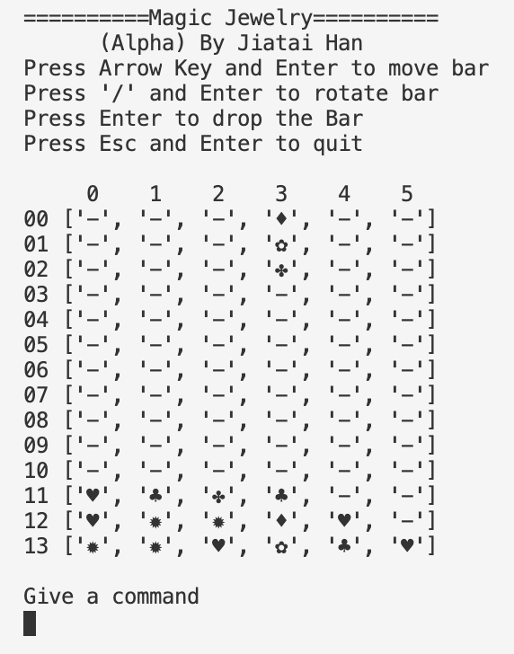

# Magic-Jewelry-Python-Game

***THIS IS AN ON-GOING PROJECT...***

A Python version of 1990 NES game ["Magic Jewelry"](https://en.wikipedia.org/wiki/Magic_Jewelry) (click to visit Wikipedia for details), originally developed by **Hwang Shinwei**, released by **RCM**.

#### Introduction

The reason that I want to develop a Python version of this game is that, when I was little (around 1998) and playing all different kinds of NES game on my console, my grandpa always liked to play Magic Jewelry, which might be his favorite game (even than Tetris), I still remember the statue of liberty and all those colorful jewelries with beautiful background music on our 21-inch little TV. I grew up with my grandpa and he passed away in 2006, I hope this game can be deliver my best memory to him.

##### Current Progress:

12/22/2019

Applied most basic functions, a single point with color that can remove neighbor points:

#### Development Plan

- ~~Develop a text/console version firstly, using small-size pre-defined grid, by changing a certain point on the grid to test the removing function (>= 3 same-color jewelries was formed), every time a point was changed to trigger the chain reaction.~~
- Change to pre-defined grid that has more empty space, and create randomly generated 3-in-1 jewelry combination (like original game), which can move up-down, left-right, also make it changeable to rotate the pattern of jewelries on the 3-in1 combination. After moving and assigning position, then trigger DFS for removing.
- Add gravity, all existed jewelries are stayed below the grid, and if chain-reaction was triggered, the jewelries with holes below can drop down due to the gravity.
- Set the dropping 3-in-1 jewelry with gravity and certain dropping rate, no longer moving freely to up.
- Add graphic interface and more features